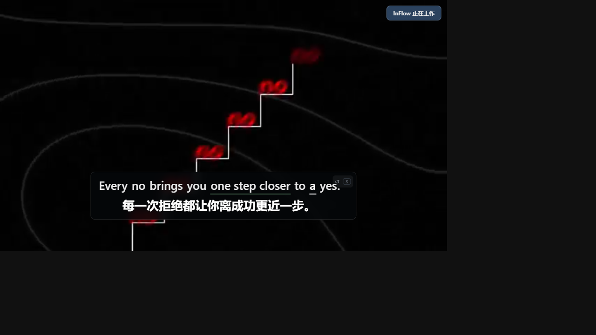
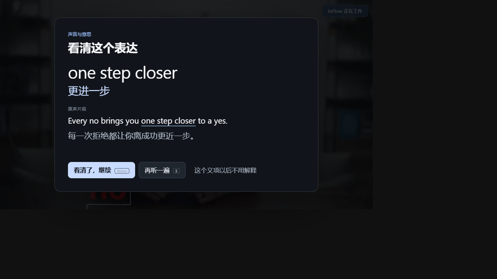

# InFlow English

**Readable bilingual captions and natural-sentence replay inside English YouTube videos.**

[](https://github.com/Yueyue673/inflow-english/actions/workflows/ci.yml)


InFlow appears with the video, reads the caption tracks already available to the current YouTube player, shows Chinese first and English second, and replays the current complete caption segment with `S`.

It does **not** wait for Python, `yt-dlp`, ASR or a model before showing captions. If a video has no supported track, YouTube keeps playing and InFlow gives a bounded, retryable error.



## Install

The current release is a **public source alpha**, not yet a Chrome Web Store listing.

1. Download `InFlow-English-Chrome-0.2.5.zip` and its checksum from the matching [GitHub Release](https://github.com/Yueyue673/inflow-english/releases).
2. Extract it into a stable folder.
3. Open `chrome://extensions`, enable Developer mode, choose **Load unpacked**, and select that folder.
4. Open an ordinary English YouTube watch page and refresh already-open tabs once.

A visible InFlow status should appear near the video within one second. See the full [installation and update guide](docs/INSTALL.md).

> One-click installation and automatic extension updates require Chrome Web Store approval. Listing assets are prepared under [`store/`](store/), and the remaining account-owner path is documented in [`store/SUBMISSION.md`](store/SUBMISSION.md); approval has not happened yet.

## What the standalone extension does

- Visible startup state at `document_start` instead of a hidden loading dot.
- Chinese primary caption line and English supporting line.
- `S` or the quiet replay control repeats the current natural caption segment.
- Captions hide during ads and return for the main video.
- Same-document YouTube navigation replaces old caption state instead of leaking it into the next video.
- Missing tracks and network failures terminate within a fixed budget; the source video is never paused by a caption failure.
- Works without a local backend.

Recent isolated browser measurements on the release code:

```text
status visible        63–146 ms
bilingual captions    92–634 ms
missing-track error   about 4.1–4.3 s
retry after recovery  20–439 ms
same-document switch  13–264 ms
```

These are engineering checks, not a promise that every YouTube/network combination has the same latency.

## Optional experimental learning

Automatic teaching pauses are **off by default**. Enabling them is a separate action in the popup and requests optional access to the local service only at that moment.

When a verified local pack already exists:

```text
explicit opt-in
→ 8 seconds of continuous, visible, non-ad playback
→ preloaded natural phrase at a safe pause boundary
→ natural audio → expression + current sense → natural audio
→ 看清了，继续
```



The teaching card does not force a known/familiar/unclear answer. `再听一遍` is counted separately from familiarity. `这个义项以后不用解释` is an explicit, reversible suppression signal.

This layer remains experimental because one completed interaction does not prove durable learning. Long-video active learning is feature-flagged off in production while real-window quality work continues.

## Supported scope

Current public target:

- Chrome 120 or newer;
- ordinary `https://www.youtube.com/watch?v=...` pages;
- videos whose player exposes an English or Chinese timed-text track;
- videos up to three hours for the standalone caption path.

Not currently promised:

- Shorts, live streams, embeds, DRM or member/age-restricted content;
- videos with no usable YouTube caption track;
- Firefox/Safari;
- Chrome Web Store availability;
- learning-effect, retention or transfer gains;
- automatic installation of the experimental Python backend.

## Privacy and security

The public extension requests one extension permission: `storage`.

Required host access is limited to YouTube. Localhost access is optional and requested only after the user enables experimental learning. There is no cookies permission, browsing-history permission, `<all_urls>`, remote code, advertising or InFlow cloud analytics.

Production UI state lives in a closed shadow root. Page-script synthetic clicks and keyboard events cannot write learning state. Local service requests are constrained by sender, Host, Origin, Fetch Metadata, body-size and asset allowlists.

Read [Privacy](PRIVACY.md) and [Security](SECURITY.md).

## Architecture

```text
YouTube player caption tracks
→ bounded page bridge
→ isolated content script
→ closed Shadow DOM captions + replay

optional explicit opt-in
→ allowlisted MV3 service worker
→ 127.0.0.1 local learning service
→ replayable event/profile state
```

The two paths are intentionally independent: local learning can be unavailable without delaying captions.

See [Architecture](docs/ARCHITECTURE.md), [State matrix](docs/STATE-MATRIX.md), and [Product spine](PRODUCT-SPINE.md).

## Development

```bash
python -m pip install -r requirements/ci.txt
python -m wn download oewn:2024
python -m playwright install chromium
python -m unittest discover -s tests -p "test_*.py" -q
python tools/build_extension.py
```

The browser contracts cover standalone/offline captions, ads, SPA navigation, bounded failure, retry, closed-shadow privacy, explicit learning opt-in, the 8-second gate, playback ownership and event replay. Tests use isolated data roots.

See [Contributing](CONTRIBUTING.md) and [Troubleshooting](docs/TROUBLESHOOTING.md).

## Release status

- Extension: `0.2.5`
- Adaptive policy: `adaptive-v5`
- Profile schema: `3`
- Reducer: `rules-v5`
- VideoPack builder: `1.9.2`
- License: MIT

The repository deliberately excludes downloaded media, models, runtime logs, learning ledgers, profiles and private QA artifacts.
